 # Poslovna inteligencija

 Dalibor Aleksić 888

 Elektronski fakultet u Nišu


 ## Pregled projekta

 ### Cilj projekta

Glavni cilj projekta je skladištenje i vizualizacija podataka iz određenog skupa podataka (data-set). Za skup podataka su uzeta časovna merenja vremenskih parametara (temperatura, vlažnost vazduha, pritisak..).


### Skup podataka

Skup podatak sadrži meranja vremenskih parametara

- temperatura
- vlažnost vazduha
- pritisak
- opis vremena (sunčano, pretežno oblačno...)
- smer vetra
- brzina vetra

za vremenski period od 2013 - 2017. godine. Iniciajalni skup podataka je sadržao podatke za 36 gradova, ali je za ovaj projekat uzeto u obzir samo 8 gradova u Americi:

- Los Angeles
- Majami
- Denver
- Mineapolis
- Huston
- Boston
- Vankuver
- Las Vegas

Prilikom odabira gradova, uzeta je njihova geografksa pozicija tako da priblizno cine mrežu

```
  N
W * E
  S

A ....... B ....... C
.         .         .
D ....... E ....... F
.         .         .
G ....... H ....... J
```

Podaci su oragnizovani u više `.csv` fajlova tako da su merenja za svaki tip parametra smeštena u zaseban `.csv` fajl: 
- `temperature.csv`
- `pressure.csv`
- `weather.csv`
- ...

Struktura `.csv` fajla:

```
          +----------+-----------+--------+-+
          |  grad_1  |  grad_2   |   ...  |
+-------------------------------------------+
| vreme_1 | vrednost | vrednost  |        |
+-------------------------------------------+
| vreme_2 | vrednost | vrednost  |        |
+-------------------------------------------+
| vreme_3 | vrednost | vrednost  |        |
+-------------------------------------------+
| ...     |          |           |        |
+         +          +           +        +

```

Redovi za vremena se poklapaju u svim fajlovima (vrednost `vreme_1` se poklapa u svim fajlovima)

Jedino se struktura `city_attributes.csv` razlikuje:

```
          +----------+-----------+-----------+
          |  country |  latitude | longitude |
+--------------------------------------------+
| city_1  | vrednost | vrednost  | vrednost  |
+--------------------------------------------+
| city_2  | vrednost | vrednost  | vrednost  |
+--------------------------------------------+
| city_3  | vrednost | vrednost  | vrednost  |
+--------------------------------------------+
| ...     |          |           |           |
+         +          +           +           +

```


# Realizacija

Za vizualizaciju podataka su iskoriščeni alati iz ELK grupe alata ([__Elastic stack__](https://www.elastic.co/products/elastic-stack)) :
- [Elasticsearch](https://www.elastic.co/products/elasticsearch) baze - za skladištenje, indeksiranje i pretraživanje podataka
- [Kibana](https://www.elastic.co/products/kibana) - za vizualizaciju podataka

Pored ovih alata iskorščeni su i:
- [MySQL](https://www.mysql.com/) baza - kao glavno mesto za skladištenje podataka (DataWarehouse)
- [Pentaho Data Integration](https://www.hitachivantara.com/en-us/products/big-data-integration-analytics/pentaho-data-integration.html) - za transformaciju i unos podataka iz `csv` fajova u `MySQL` i `Elasticsearch` bazu.

Pojednostavljeni tok podatak je prikazan na sledećem diagramu:

```
CSV data-set -----------> Data Warehouse -----------> ElasticSearch <====== Kibana
               Pentaho                     Pentaho
               Data                        Data
               Integration                 Integration
```

> *Obaveštenje:* Moguće je i direkno unošenje podataka iz `csv` fajlova u `elasticsearch` bazi, ali je odabrano da se prvo podaci unose u `mysql`/`datawarehouse` bazi pa onda iz te baze u `elasticsearch` iz razloga da bi više ličilo na realni sistem.

### Datamart

Za model je uzeta `star` šema:

```
+--------------------------------+                                                          +-------------------------+
|          DATETIME_DIM          |                                                          |         CITY_DIM        |
+--------------------------------+                                                          +-------------------------+
+--------------------------------+                                                          +-------------------------+
| datetime_dim_id        int     +<-----+                                              +--->+ city_dim_id             |
+--------------------------------+      |                                              |    +-------------------------+
| hour                   int     |      |                                              |    | name            varchar |
| minute                 int     |      |                                              |    | country         varchar |
| year                   int     |      |                                              |    | latitude        double  |
| month                  int     |      |                                              |    | longitude       double  |
| day_of_year            int     |      |                                              |    +-------------------------+
| day                    int     |      |                                              |                               
| year_week              int     |      |     +---------------------------------+      |                               
| year_quarter           int     |      |     |          MEASURMENT_FACT        |      |                               
| am_pm                  varchar |      |     +---------------------------------+      |
| astronomical_season    varchar |      |     +---------------------------------+      |
| meterological_season   varchar |      |     | measurment_id            int    |      |
+--------------------------------+      |     +---------------------------------+      |
                                        +-----+ datetime_dim_id          int    |      |
                                              | city_dim_id              int    +------+
                                              | description_dim_id       int    +------+
                                              +---------------------------------+      |
                                              | temperature_kelvin       double |      |    +------------------------------+
                                              | temperature_celsius      double |      |    |     WEATHER_DESCRIPTION_DIM  |
                                              | temperature_fahrenheit   dobule |      |    +------------------------------+
                                              | humanity                 double |      |    +------------------------------+
                                              | pressure                 double |      +--->+ description_dim_id   int     |
                                              | presure_standard_diff    double |           +------------------------------+
                                              | wind_direction           double |           | description          varchar |
                                              | wind_speed               double |           +------------------------------+
                                              +---------------------------------+

```

U odnosu na originalni skup podataka dodate su nove aditivne vrednosti:
- temperature_celsius
- temperature_fahrenheit
- pressure_standard_diff što predstavlja razliku između izmerene vrednosti i normalnog vazdušnog pritiska

### Pentaho Data Integration transformacije

Transformacije su podeljene u 2 velike sekcije:
- transformacije za unos podataka iz `csv` fajlova u DataWarehouse bazu (`dw_insert-job`)
- transformacije za unos podataka DataWarehouse baze u Elasticsearch bazu (`es-job`)

Za obe sekcije su kreirani odgovarajuce Pentaho `job`-ovi i objedinjeni u `main-job`-u.

#### Main job
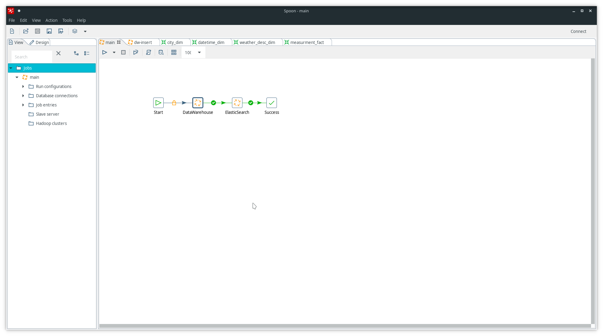

##### DateWarehouse job
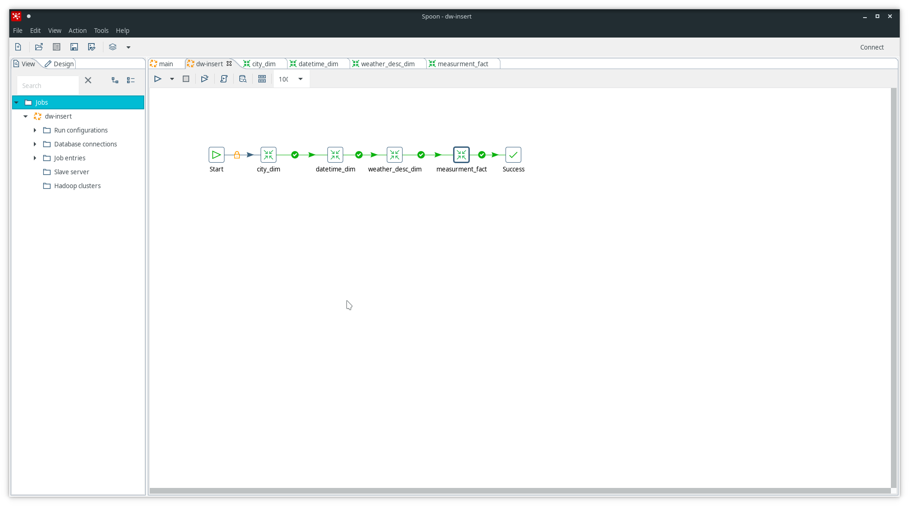

##### CityDIM transformation
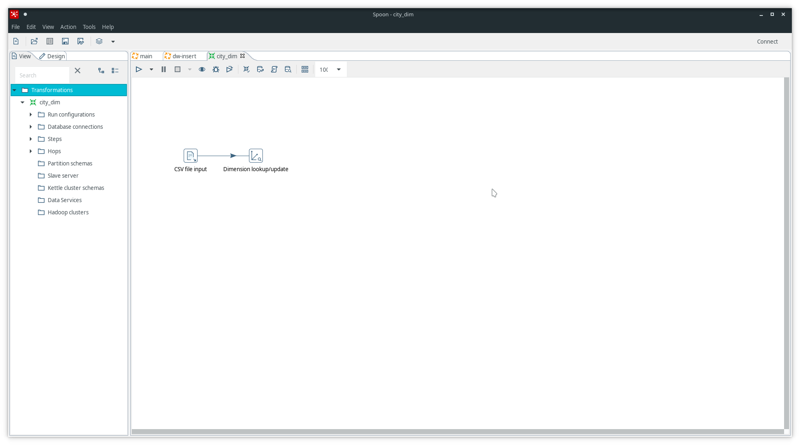

#####  DatetimeDIM transformation
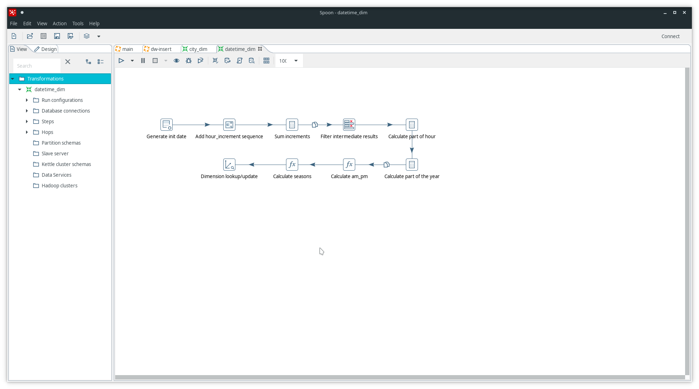

##### Weather description DIM
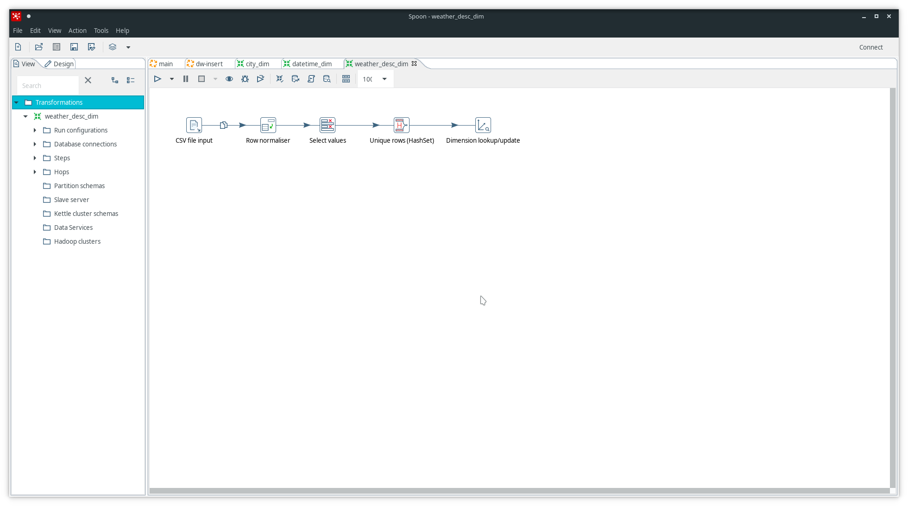

##### Measurments FACT
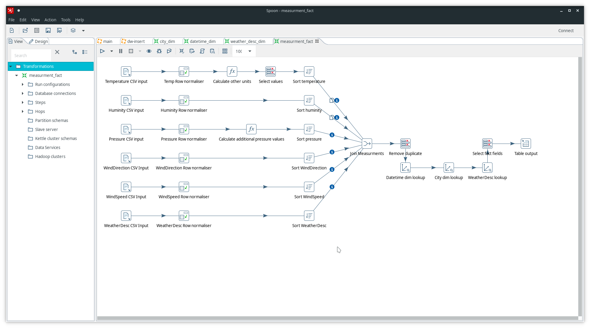

#### Elastic search job 
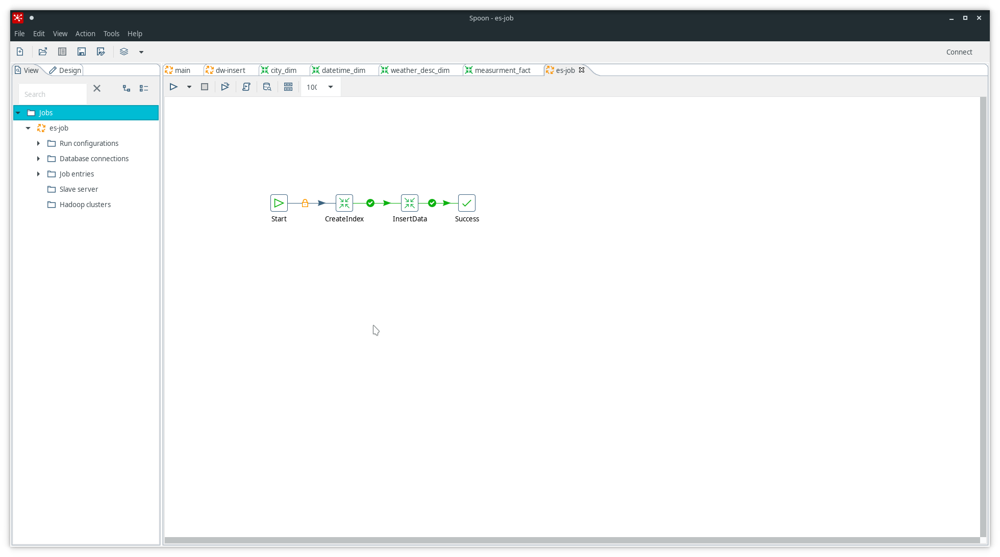

##### Elasticsearch index create transformation
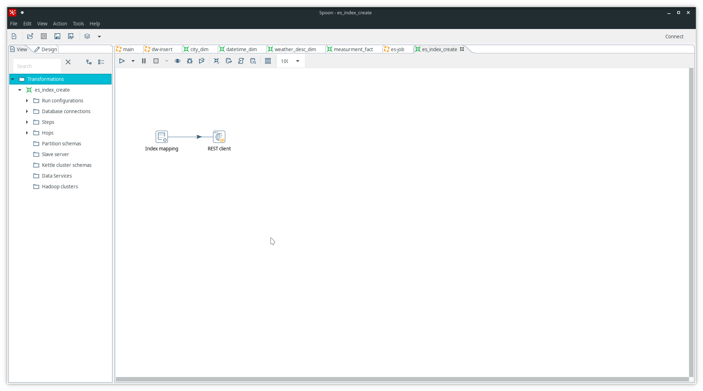

##### Elastic search insert transformation
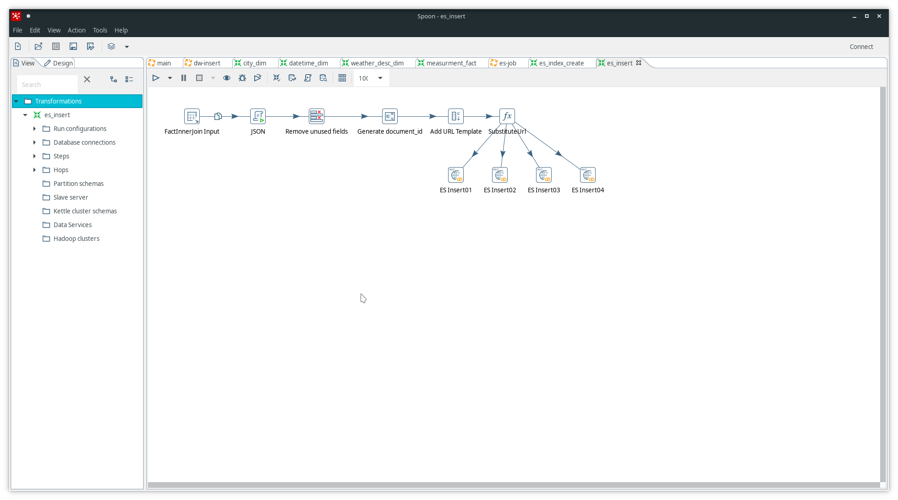


### Elasticsearch

U `elasticsearch` bazi je kreiran nov `measurments` indeks slanjem 

`POST http://<elasticsearch-ip-address>/measurments` 
zahteva sa sadržajem:

```yaml
mappings:
  properties:
    temperature:
      properties:
        kelvin: {type: float}
        celsius: {type: float}
        fahrenheit: {type: float}
    huminity:
      properties:
        percentage: {type: float}
    pressure:
      properties:
        mbars: {type: float}
        standard_difference: {type: float}
    wind:
      properties:
        direction: {type: float}
        speed: {type: float}
    date:
      properties:
        date_time: {type: date, format: "dd.MM.yyyy HH:mm"}
        day_of_year: {type: integer}
        year_week: {type: integer}
        year_quarter: {type: integer}
        am_pm: {type: keyword}
        astronomical_season: {type: keyword}
        meteorological_season: {type: keyword}
    city:
      properties:
        name: {type: keyword}
        country: {type: keyword}
        location: {type: geo_point}
    description: {type: text}
```

### Kibana

#### Diagrami
Dijagrami napravljeni u Kibani su skoncentrisani oko temperature. 

> Min/Avg/Max temperature po gradovima za određeni vremenski period
 
 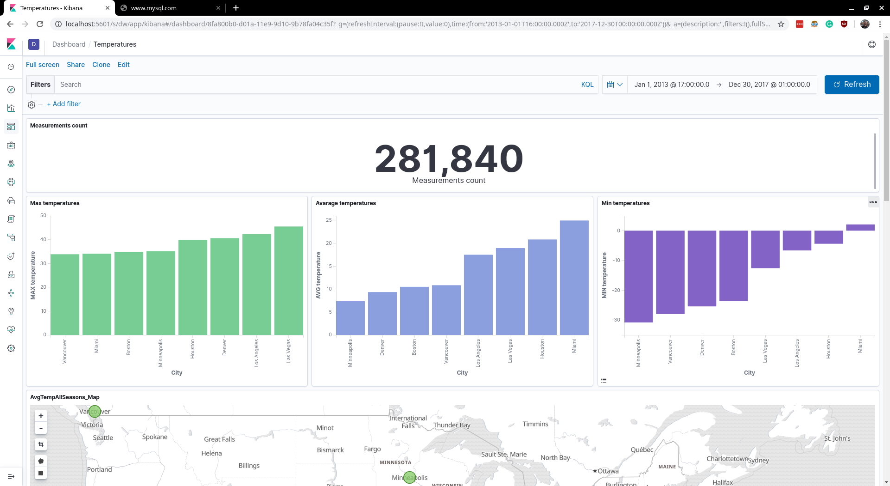

> Min/Avg/Max temperature po gradovima za određeni vremenski period na mapi
 
 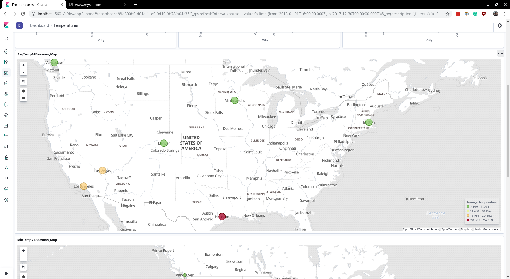

> Min/Avg/Max temperature po gradovima po sezoni za vremensi period

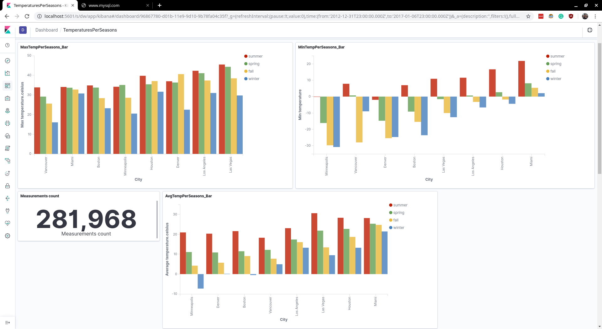
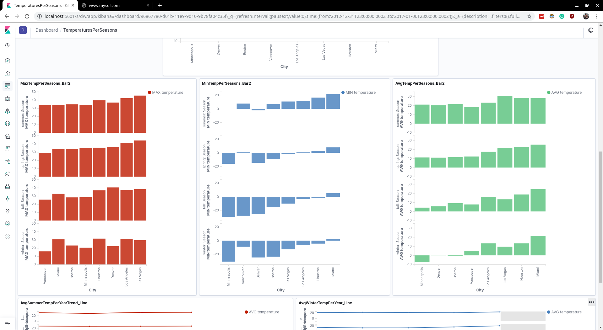
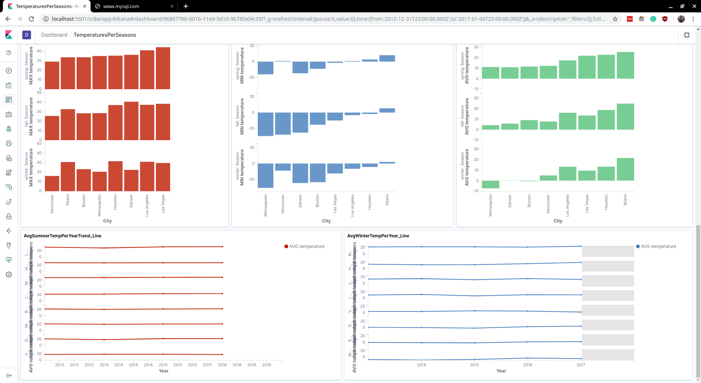

> Min//Avg/Max temperature po mesecima

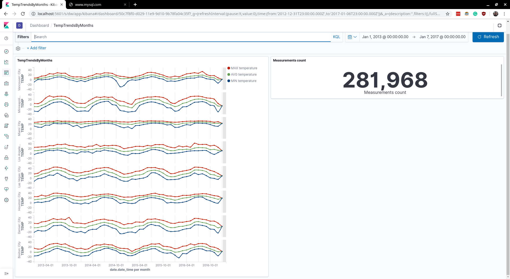

#### Masinsko učenje

Kibana takođe poseduje funcionalnost da analizira postojeće podatke, detektuje anomalijje i predviđa buduća dešavanja.

Ovu funkcionalnost obezbeđuje `Elastic.co` kompanija koja zapravo izrađuje `elasticsearch` i `kibana` proizvode. Funkcionalnost je dostupna samo u `Premium` paketu sa mogućnost probnog perioda.

Za primer je uzeta metrika maksimalna dnevna temperatura u Los Anđelesu.

#### Anomalije

Anomalije su označene tačkama i izlistane u listi pri dnu. Takođe je i dat razlog zbog čega je vrednost označena kao neubičajna.

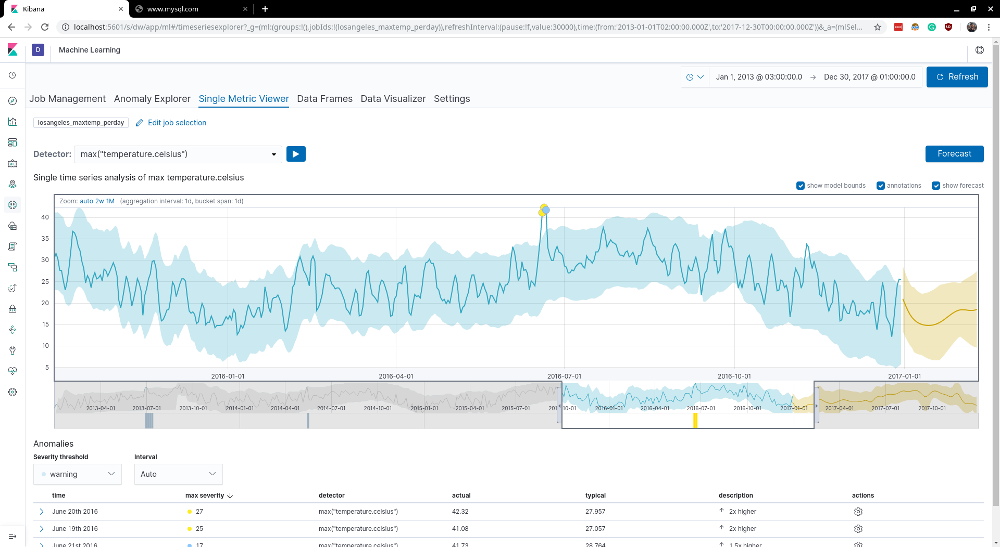

#### Predviđanja

Predviđene vrednosti su onačene žutom linijom.

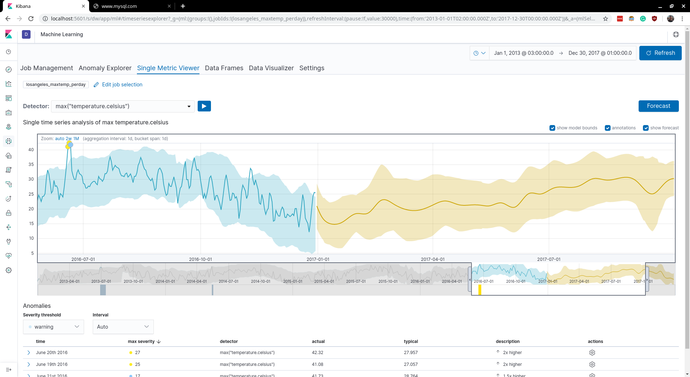
